# Card Survival Map Navigator

A CLI tool to help players navigate and manage locations in Card Survival game. This project was primarily developed with the assistance of AI (specifically, using Anthropic's Claude).

## Why This Tool?

Card Survival is a game of exploration and discovery, where uncovering new locations and resources is a key part of the experience. This tool was created to enhance that experience by:

- Letting you document your own journey without spoilers
- Helping you remember locations and resources you've personally discovered
- Creating your own personalized map as you explore the game world
- Maintaining the excitement of discovery while having a reliable way to track your findings

Instead of looking up complete maps online that might spoil the game, this tool lets you build your knowledge gradually. As you explore in-game, you can:

1. Add new locations as you discover them
2. Note down resources you find at each location
3. Track connections between areas you've explored
4. Find your way back to resources you've previously discovered

This way, you get the best of both worlds - the thrill of discovering new locations yourself, while having a reliable system to remember what you've found.

## Features

### 📍 Location Management
- Create and manage game locations
- Set up directional connections (north, south, east, west)
- Track current location and available paths
- View detailed information about each location

### 🎯 Resource Tracking
- Add and manage resources at each location
- Find all locations containing specific resources
- Locate nearest source of any resource
- Automatic resource synchronization across locations

### 🗺️ Navigation Features
- Interactive command-line interface
- Pathfinding between locations
- Display shortest routes with step-by-step directions
- Find optimal paths to needed resources

### 💾 Data Management
- Save and load maps
- List available map files
- Support for multiple map configurations

## Installation

1. Clone the repository:
```bash
git clone https://github.com/YourUsername/card-survival-map-navigator.git
cd card-survival-map-navigator
```

2. Install the package in development mode:
```bash
# Install with all development dependencies
pip install -e ".[dev]"

# Or install only runtime dependencies
pip install -e .
```

## Usage

1. Start the program using the installed command:
```bash
card-survival-map
```

2. Create a new map or load the example map:
```bash
# Create example map
python -m src.infrastructure.cli.example_setup

# Then in CLI:
load example_map.json
```

3. Basic commands:
```bash
# List all commands and categories
help

# Create a new location
add_location Forest wood,berries

# Move to a location (interactive if no location specified)
goto
# Or directly:
goto Forest

# See current location info
look

# Find nearest resource (interactive if no resource specified)
nearest
# Or directly:
nearest wood

# Find resource locations (interactive if no resource specified)
find
# Or directly:
find wood

# Find path to location (interactive if no location specified)
path
# Or directly:
path Mountain

# Save your map
save my_map.json
```

Interactive Features:
- Commands that require locations or resources can be used without arguments
- When no argument is provided, you'll get:
  - Numbered list of available options
  - Can enter either number or name
  - Fuzzy matching for misspelled names
  - "Did you mean?" suggestions
  - Easy cancellation with Enter or Ctrl+C

## Command Reference

Type `help <category>` for detailed information about each category.

### Navigation Commands
```
goto <location>      Move to a specific location
look                 Show information about current location
path <dest>         Find path to target location
nearest <resource>   Find nearest location with specified resource
```

### Location Management Commands
```
add_location <name> [resource1,resource2,...]   Create a new location
add_connection <from> <to> <direction>          Connect two locations
list_locations                                  Show all locations and details
```

### Resource Management Commands
```
add_resource <location> <resource1,resource2,...>   Add resources to location
find <resource>                                     Find all locations with resource
list_resources                                      Show all resources and locations
```

### Map Management Commands
```
save [filename]      Save current map to file (default: map_data.json)
load <filename>      Load map from file
list_maps           Show available map files
```

### General Commands
```
help                Show command categories or 'help <command>' for details
help <category>     Show all commands in a category (navigation/locations/resources/maps)
quit                Exit the program
```

## Development

### Project Structure
```
cs-fantasy-map-helper/
├── docs/
│   └── testing_guidelines.md     # Testing documentation
├── src/
│   ├── domain/                   # Business entities
│   │   ├── entities/            
│   │   └── repository/          
│   ├── application/              # Business logic
│   │   ├── interfaces/          
│   │   ├── usecases/           
│   │   └── game_map_service.py  
│   └── infrastructure/           # External interfaces
│       ├── cli/                 
│       └── persistence/         
├── pyproject.toml               # Package configuration
└── requirements.txt             # Direct dependencies
```

### Testing

#### Test Organization
The project follows a structured testing approach with test files colocated with the code they test:
```
src/
├── domain/entities/
│   ├── direction_test.py      # Tests for Direction enum
│   └── location_test.py       # Tests for Location entity
├── application/usecases/
│   ├── location_management_test.py
│   ├── resource_management_test.py
│   └── map_management_test.py
└── infrastructure/
    ├── persistence/
    │   └── json_map_repository_test.py
    └── cli/commands/
        └── interactive_test.py
```

#### Running Tests
```bash
# Install development dependencies
pip install -e ".[dev]"

# Run all tests with coverage report
pytest

# Run specific test file
pytest src/domain/entities/location_test.py

# Run specific test class
pytest src/domain/entities/location_test.py::TestLocation

# Run tests with output
pytest -v

# Generate HTML coverage report
pytest --cov-report=html

# Type checking
mypy src

# Code formatting
black src
isort src
```

#### Coverage Reports
Coverage reports are generated automatically when running tests and can be found in:
- Terminal output showing line coverage
- HTML report in `htmlcov/index.html` for detailed coverage view

#### Test Categories
1. **Unit Tests**: Test individual components (entities, use cases)
   - Located alongside source files
   - Focus on single responsibility
   - Use fixtures for dependencies

2. **Integration Tests**: Test component interactions
   - Test use cases with repositories
   - Verify workflow sequences
   - Test persistence operations

3. **Functional Tests**: Test CLI interfaces
   - Command parsing and execution
   - Interactive features
   - Error handling

## Architecture

The project follows Clean Architecture principles to ensure separation of concerns and maintainability. Below are detailed diagrams showing the system architecture and component relationships.

### Clean Architecture Layers


### Feature Organization

The following diagram shows how different features are organized and managed through the GameMapService:

```mermaid
graph LR
    subgraph "📍 Location Management"
        LC["Create Locations"]
        LM["Manage Connections"]
        LN["Navigation"]
    end

    subgraph "🎯 Resource Management"
        RA["Add Resources"]
        RF["Find Resources"]
        RN["Nearest Resource"]
    end

    subgraph "🗺️ Map Features"
        MN["Navigation"]
        MP["Pathfinding"]
        MI["Interactive CLI"]
    end

    subgraph "💾 Data Management"
        DS["Save Maps"]
        DL["Load Maps"]
        DM["Multiple Maps"]
    end

    GameService --> LC & LM & LN
    GameService --> RA & RF & RN
    GameService --> MN & MP & MI
    GameService --> DS & DL & DM
```



### Core Components

Class diagram showing key components and their relationships:


The architecture ensures:
- Clear separation of concerns through layered design
- Domain-driven design with core entities and business rules
- Dependency inversion through interfaces
- Modular and extensible feature organization
- Clean data flow through well-defined boundaries

## AI Contribution

This project was created with the assistance of Anthropic's Claude AI. The AI helped with:
- Initial project planning and structure
- Implementation of core features
- Command-line interface design
- Documentation and example creation
- Code organization and best practices

Human oversight and testing were used to ensure the quality and functionality of the final product.

## License

This project is licensed under the MIT License - see the LICENSE file for details.

## Acknowledgments

- Created with assistance from Anthropic's Claude AI
- Inspired by the Card Survival game
- Built for the Card Survival gaming community
